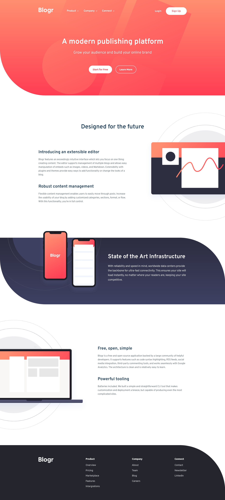

# Frontend Mentor - Blogr landing page solution

This is a solution to the [Blogr landing page challenge on Frontend Mentor](https://www.frontendmentor.io/challenges/blogr-landing-page-EX2RLAApP). Frontend Mentor challenges help you improve your coding skills by building realistic projects. 

## Table of contents

- [Overview](#overview)
  - [The challenge](#the-challenge)
  - [Screenshot](#screenshot)
  - [Links](#links)
- [My process](#my-process)
  - [Built with](#built-with)
- [Author](#author)

## Overview

Blogr landing page using plain HTML, CSS and some JavaScript

### The challenge

Users should be able to:

- View the optimal layout for the site depending on their device's screen size
- See hover states for all interactive elements on the page

### Screenshot

### Links

- Solution URL: [here](https://your-solution-url.com)
- Live Site URL: [here](https://your-live-site-url.com)

## My process

  - Created HTML based on the more complex layout (ie Desktop)
  - Styled from mobile first
  - Added essential JavaScript that would be used by both mobile and desktop layout
  - Finished styling for Desktop

### Built with

- Semantic HTML5 markup
- CSS custom properties
- Flexbox
- Mobile-first workflow

## Author

- Frontend Mentor - [@pilatech](https://www.frontendmentor.io/profile/yourusername)
- Twitter - [@pchinyengetere](https://www.twitter.com/pchinyegetere)
